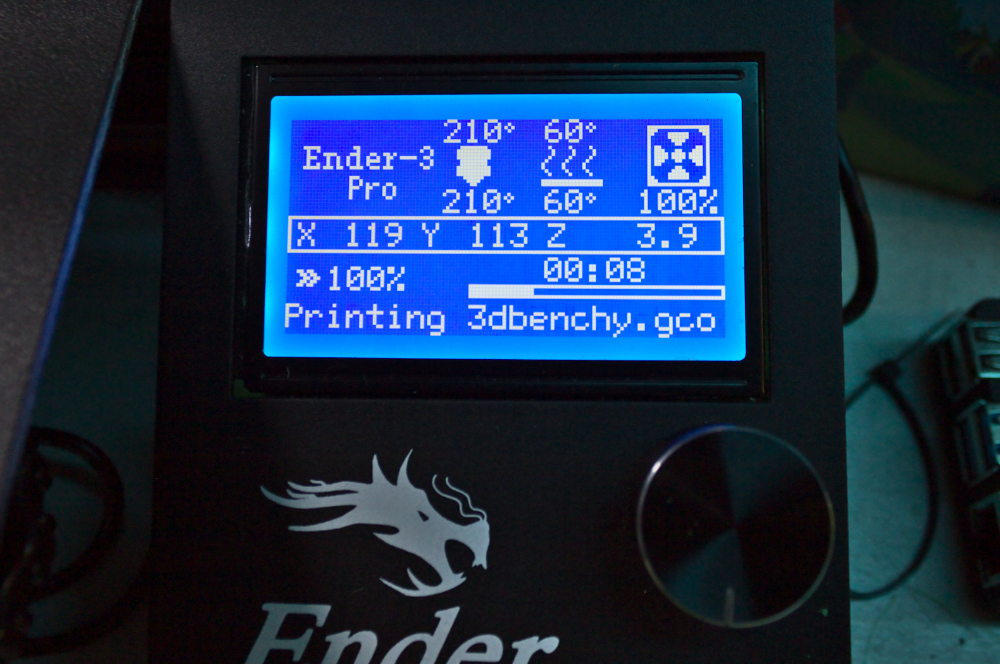

# octoprint-lcdinfo

Adds helpful messages about what Octoprint is doing to the printer's display via `M117`.

Current features:

* Filename while printing
* IP Address on startup
* Print progress
* If Octoprint has paused

## Setup

Install via the bundled [Plugin Manager](https://docs.octoprint.org/en/master/bundledplugins/pluginmanager.html)
or manually using this URL:

    https://github.com/computerjoe314/octoprint-lcdinfo/archive/master.zip

## Configuration

If your printer supports [M73 commands](https://marlinfw.org/docs/gcode/M073.html), you can enable them in settings 
and the plugin will send progress to the printer as well. 